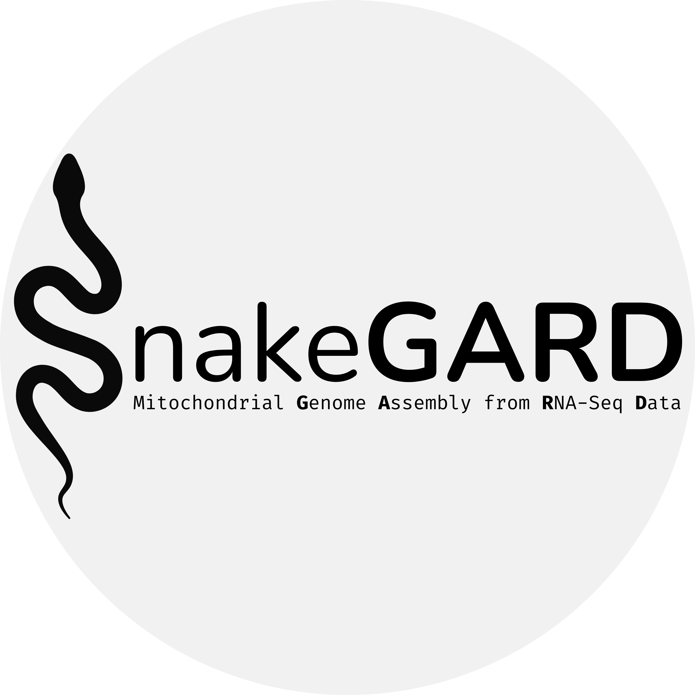

<p align="center">
  
</p>

<p align="center">
  <a href="https://www.buymeacoffee.com/lprabelo" target="_blank">
    
  </a>
</p>

# Contents Overview
- [System Overview](#system-overview)
    - [Licence](#licence)
- [Contact](#contact)

# SnakeGARD
***SnakeGARD***: A Scalable and Automated Workflow for Mitochondrial Genome Assembly from RNA-Seq Data

## Licence
##### [:rocket: Go to Contents Overview](#contents-overview)
***SnakeGARD*** is released under the **MIT License**. This license permits reuse within proprietary software provided that all copies of the licensed software include a copy of the MIT License terms and the copyright notice.
***

# Contact
##### [:rocket: Go to Contents Overview](#contents-overview)
For reporting bugs, requesting assistance, or providing feedback, please reach out to **Luan Rabelo**:
```
luanrabelo@outlook.com
```
***  